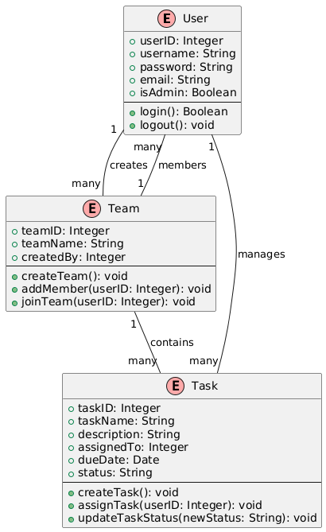

# Software Requirements Specification (SRS)

*Project Name*: Team Management Web Application

# Overview

The purpose of this document is to provide a detailed description of the software requirements for the Team Management Web Application. This document outlines the functional and non-functional requirements, user interfaces, system interactions, and other necessary details needed for the successful development and deployment of the application.

# Software Requirements

The below section provides indepth details of each feature implemented in the application.

## 1. Functional Requirements

### Login/Register Service

| ID  | Requirement |
| :-------------: | :----------: |
| FR1 | Users shall be able to register an account using an email address and password. |
| FR2 | Users shall be able to log in using their credentials. |
| FR3 | The system must validate the credentials during login and provide appropriate error messages for invalid inputs. |
| FR4 | Passwords shall be encrypted, and authentication should be secure. |
| FR5 | Role-based access control (team member, leader) shall be implemented. |

### Team Creation Service

| ID  | Requirement |
| :-------------: | :----------: |
| FR6 | Users must be able to create a new team by providing a team name |
| FR7 | The system must prevent duplicate team names for a single user. |
| FR8 | Team card should display: Team information, including members and tasks, must be stored in the database. |
| FR9 | Team creators shall have admin privileges, allowing them to add or remove team members. |
| FR10 | Admins must be able to view all team details, including member lists and assigned tasks. |

### Join Team Service

| ID  | Requirement |
| :-------------: | :----------: |
| FR11 | User must be able to join team by choosing `TeamName` and entering `email`. |
| FR12 | The system must prevent users from joining the same team multiple times. |
| FR13 | dmins must be able to add member to the team. |
| FR14 | Team members shall be able to update task status ['to-do', 'inprogress', 'done']. |
| FR15 | Users must have the option to leave a team they have joined. |

### Add Task Service

| ID  | Requirement |
| :-------------: | :----------: |
| FR16 | Admins must be able to create tasks by providing a task name, description & assignee. |
| FR17 | Tasks must be assigned to specific team members by the admin. |
| FR18 | Team members must be able to view all tasks assigned to them. |
| FR19 | Each task must have an initial status set to "to-do". |
| FR20 | Tasks must be stored in the database along with their status, assignee, and associated team. |

### Team dasboard

| ID  | Requirement |
| :-------------: | :----------: |
| FR21 | A centralized dashboard should display all the team information. |
| FR22 | The team dasboard must include option to delete other team member for team admin. |
| FR23 | It must provide option to delete the team. |
| FR24 | The system must warn admin when opting for Team deletion, in case of team members existence. |
| FR25 | It must provide an option to Add task to the respective team |

## 2. Non-Functional Requirements

### Security

| ID  | Requirement |
| :-------------: | :----------: |
| NFR1 | All sensitive user data, including passwords, must be encrypted. |
| NFR2 | The system must support HTTPS to secure data transmission. |
| NFR3 | Users should be automatically logged out after 30 minutes of inactivity. |
| NFR4 | Failed login attempts must be restricted to three, followed by a temporary lockout. |
| NFR5 | The system must perform regular vulnerability scans. |

### Performance

| ID  | Requirement |
| :-------------: | :----------: |
| NFR6 | The system must handle up to 500 concurrent users without performance degradation. |
| NFR7 | Task creation and updates must reflect in less than 1 second on the dashboard. |
| NFR8 | Login and registration processes must complete within 2 seconds. |
| NFR9 | The system must scale to support 1000 teams without database performance issues. |
| NFR10 | Notifications must be delivered within 5 seconds of an event trigger. |

### Usability

| ID  | Requirement |
| :-------------: | :----------: |
| NFR11 | The user interface must be intuitive and easy to navigate for all user roles. |
| NFR12 | The system must provide tooltips and help text for all major features. |
| NFR13 | Error messages must clearly indicate the cause and provide guidance for resolution. |
| NFR14 | The application must support copy action for name and details. |
| NFR15 | The application should be responsive with varying screen sizes |

### Scalability

| ID  | Requirement |
| :-------------: | :----------: |
| NFR16 | The application must be able to scale up the tasks upon utilisation. |
| NFR17 | Database queries must be optimized to handle increasing data size. |
| NFR18 | The system must balance user load efficiently when multiple users perform same/similar action. |
| NFR19 | Cloud services must be used to dynamically allocate resources. |
| NFR20 | The system must support integration with third-party APIs without performance issues. |

### Reliability

| ID  | Requirement |
| :-------------: | :----------: |
| NFR21 | The system must have a minimum uptime of 99.9%. |
| NFR22 | All critical user actions must be logged for auditing purposes. |
| NFR23 | The user must be stored, so that user can pick from where he/she left |
| NFR24 | The application must automatically retry failed API calls. |
| NFR25 | Error details should be clearly provided to the user. |

# Change Management Plan
# Integration Plan for Team Management Application

Introducing a new application into a corporate environment requires a strategic approach to ensure successful adoption, integration, and ongoing support. Below is a detailed point-by-point plan to embed the Team Management Application into the customer's business effectively:

---

## 1. Training and Onboarding Plan

To ensure smooth adoption by the customer’s engineers and staff, comprehensive training will be provided in phases:

### Initial Training Sessions
- **Workshops**: Conduct in-person or virtual workshops tailored to different user roles (e.g., administrators, team leaders, and team members).
- **User Manuals and Tutorials**: Provide detailed user guides and video tutorials for independent learning.
- **Interactive Demos**: Host live demonstration sessions to showcase the core features, workflows, and benefits of the application.

### Hands-On Practice
- **Sandbox Environment**: Set up a testing environment where users can experiment without impacting real data.
- **Practice Scenarios**: Create use-case scenarios that replicate typical tasks, such as assigning tasks or tracking progress.

### Ongoing Support
- **Q&A Sessions**: Schedule regular open forums for users to ask questions and get clarifications.
- **Dedicated Support Channel**: Provide a hotline or support email for immediate assistance.

---

## 2. Seamless Integration into Their Ecosystem

For the application to be effectively adopted, it must integrate with the customer’s existing tools and processes:

### Compatibility Assessment
- Perform a thorough analysis of their current software ecosystem (e.g., task management tools, communication platforms, databases).
- Identify compatibility points where the Team Management Application can plug in seamlessly.

### APIs and Data Sync
- **Integration with Existing Tools**: Utilize APIs to integrate with software like Slack (for notifications), Jira (for task tracking), or existing HR systems for user roles and permissions.
- **Data Migration**: Assist in migrating existing data (e.g., task lists, team details) into the application to ensure continuity.

### Custom Configurations
- Provide customizable options, such as tailoring notification settings, roles, and workflows to match the company’s processes.
- Develop custom plugins or extensions if required to support proprietary systems.

### Compliance and Security
- Conduct thorough security reviews to ensure the application complies with the customer’s data protection policies.
- Ensure role-based access control aligns with their internal IT policies.

---

## 3. Rapid Issue Resolution and Continuous Improvement

The success of the application depends on the ability to quickly address any issues that arise and continuously refine the product:

### Feedback Collection
- **In-App Feedback System**: Incorporate a feature allowing users to report bugs or suggest improvements directly from the application.
- **Regular Check-Ins**: Schedule periodic meetings with key stakeholders to review their experience and gather feedback.

### Dedicated Support Team
- Establish a team of engineers and support staff dedicated to addressing the customer’s queries and issues.
- Offer Service Level Agreements (SLAs) to guarantee response and resolution times for critical issues.

### Bug Tracking and Resolution
- Implement a robust issue-tracking system to log and prioritize reported problems.
- Assign a team to investigate and fix issues promptly, with clear communication to the customer about timelines and updates.

### Release Management
- Adopt an iterative release process, providing frequent updates with enhancements and bug fixes.
- Test updates in a staging environment before deployment to prevent disruptions in the production system.

---

## 4. Change Management and User Adoption

Adoption isn’t just about training—it’s about ensuring users see the value and make the application part of their daily workflows:

### Demonstrating Value
- Share use cases and success stories to show how the application solves real-world problems.
- Quantify benefits (e.g., time saved, improved collaboration) with clear metrics and reports.

### Building Champions
- Identify and train power users who can act as ambassadors within the organization.
- Empower these champions to assist their colleagues and promote adoption.

### Gamification and Incentives
- Introduce gamification elements, such as badges for completing certain actions, to encourage engagement.
- Offer incentives, like recognition in team meetings, for early adopters who actively use the platform.

### Follow-Up and Refinement
- Conduct follow-up surveys to measure satisfaction and adoption levels.
- Refine the application and training materials based on feedback.

---

## 5. Metrics to Track Success

To ensure the application is effectively embedded, key performance indicators (KPIs) will be tracked:

### Usage Metrics
- Daily active users (DAU) and monthly active users (MAU).
- Percentage of tasks created, assigned, and completed using the application.

### Adoption Rates
- Percentage of teams onboarded within the first quarter.
- Engagement rates, measured by the frequency of usage across key features.

### Feedback and Satisfaction
- Average user satisfaction rating from post-training and follow-up surveys.
- Number of reported issues resolved within the agreed SLA.

---

By addressing training, integration, issue resolution, and change management, this plan ensures a smooth transition for the customer's organization and maximizes the value of the Team Management Application.

# Traceability Links

## Use Case Diagram Traceability

| **Requirement ID** | **Requirement Description**               | **Use Case Diagram** | 
|---------------------|-------------------------------------------|-----------------------|
| R1                 | The system shall allow users to log in.  | [UC1](artifacts/UseCase_Diagrams/UC1.png)                  | 
| R2                 | The system shall allow users to create teams. | [UC2](artifacts/UseCase_Diagrams/UC2.png)               | 
| R3                 | The system shall allow admin to delete teams. | [UC3](artifacts/UseCase_Diagrams/UC3.png)               | 
| R4                 | The system shall notify users of updates. | TBD                  | 
| R5                 | The system shall maintain audit logs.    | TBD                  | 
| R6                 | The system shall support role-based access control. | [UC4](artifacts/UseCase_Diagrams/UC4.png)           | 
| R7                 | The system shall allow users to assign tasks. | [UC5](artifacts/UseCase_Diagrams/UC5.png)                  |
| R8                 | The system shall allow users to leave team. | [UC6](artifacts/UseCase_Diagrams/UC6.png)                  |

## Class Diagram Traceability

## Activity Diagram Traceability

# Software Artifacts
